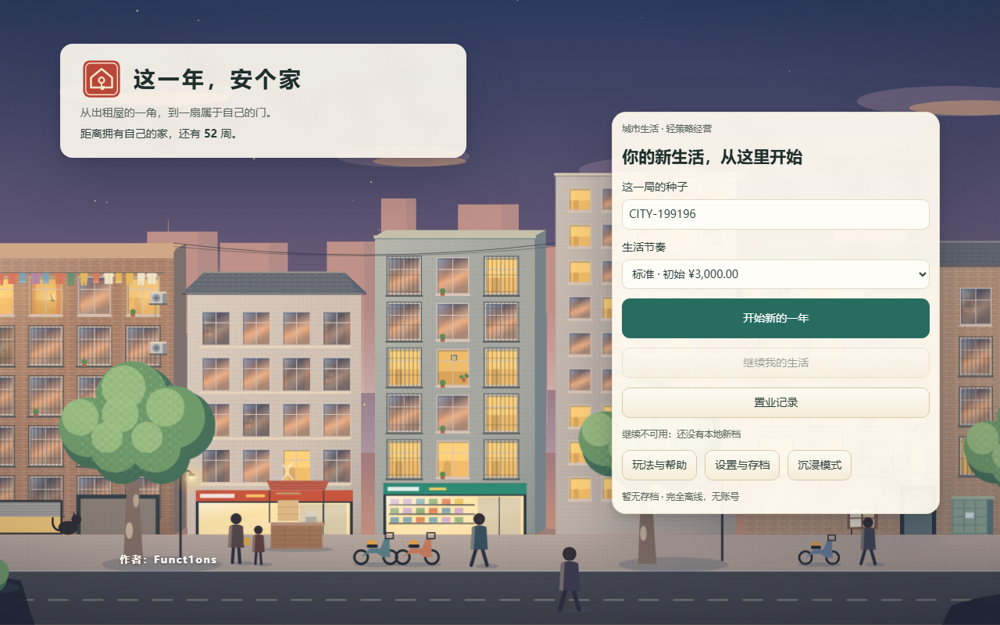
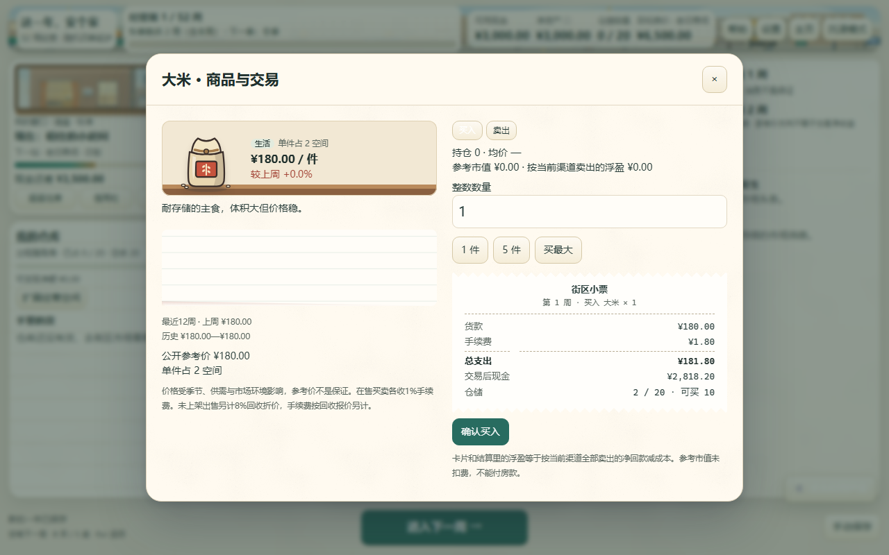
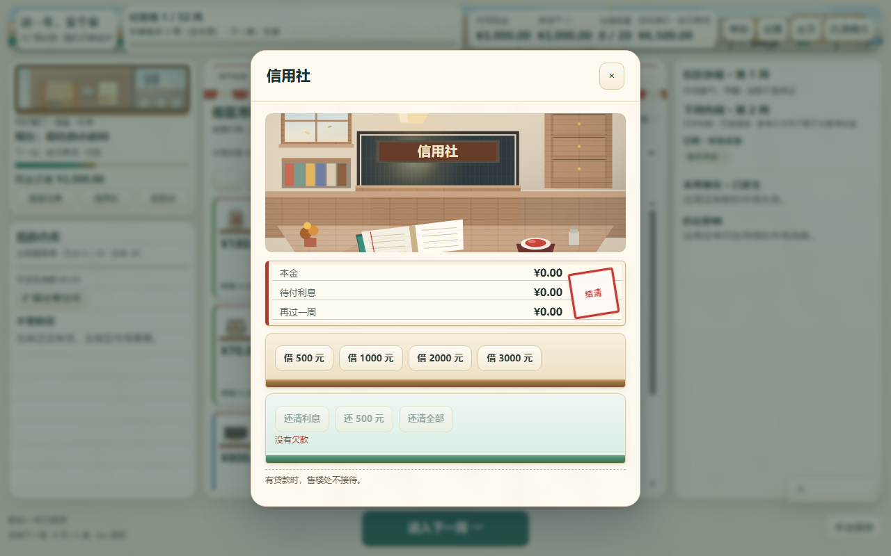
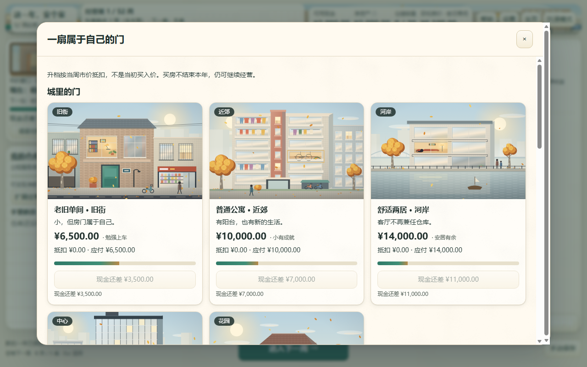
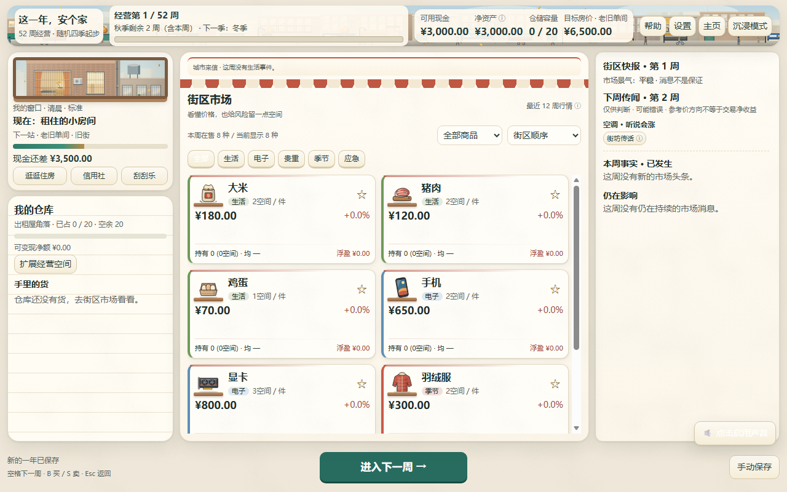
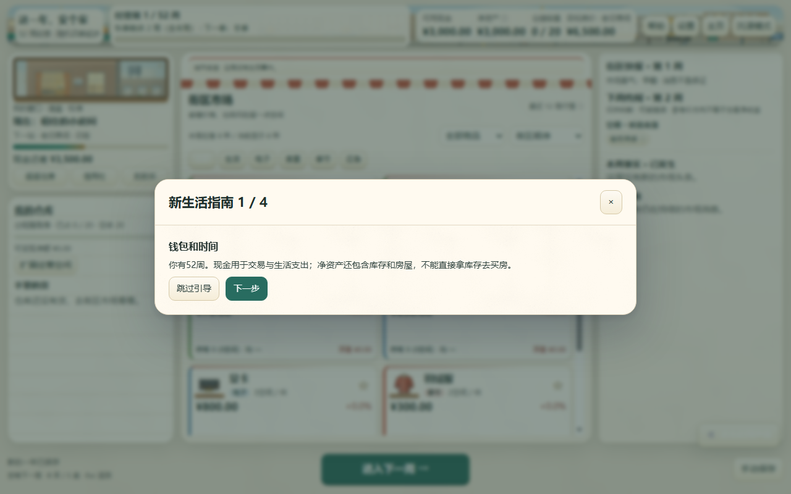
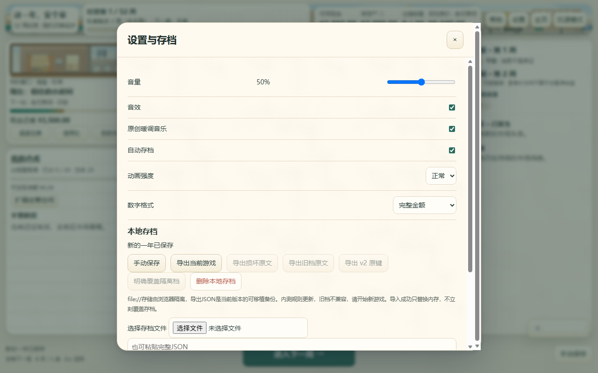

# 这一年，安个家

  

> 💡 **提示**：本README中标注了截图位置，请运行游戏后补充实际截图到 `screenshots` 文件夹

*一款模拟市场交易的买房经营游戏*

## 📖 游戏简介

**这一年，安个家** 是一款以买房为目标的经营模拟游戏。游戏灵感来源于经典游戏 **《买房记》**，玩家需要在52周的时间内通过买卖商品赚取资金，最终购买心仪的住房。

游戏融合了市场交易、信息博弈、风险管理等多种玩法元素，配合温暖的都市纸本插画风格和原创Web Audio配乐，为玩家呈现一个充满挑战与机遇的经营世界。

**当前版本：** 0.12 (存档版本 v11)

**支持平台：**
- 🖥️ **PC端**：支持Chrome/Edge浏览器，可直接双击`index.html`运行
- 📱 **安卓手机**：支持移动端浏览器访问

---

## 🎯 游戏目标

在52周的经营周期内：
1. 通过买卖12种轮换商品积累资金
2. 管理仓储容量，优化资金使用效率
3. 应对市场波动和突发事件
4. 最终攒够钱购买心仪的住房（九档可选）

*九档住房可供选择*

---

## 🎮 核心玩法

### 1️⃣ 市场交易系统

#### 商品买卖

游戏中有**12种商品**在市场中轮换，每周有**8种商品在售**可以购买。商品价格受多种因素影响而波动，玩家需要低买高卖来赚取差价。

*市场交易界面展示在售商品和持仓*

**交易规则：**
- **买入费用**：交易金额的1%（向上取整）
- **卖出费用**：交易金额的1%（向上取整）
- **在售商品**：按市价买卖
- **下架商品**：只能卖出，按回收价（市价×92%）计算
- **快速交易**：可一键买/卖 1件、5件或最大/全部数量
- **自定义数量**：支持输入指定数量进行交易

#### 仓储管理

玩家拥有有限的仓储容量，需要合理管理持仓：
- **初始容量**：20件
- **扩容方式**：升级仓储（四档：20/40/75/120）
- **扩容费用**：支付累计租赁投入差额

*我的仓库：管理所有持仓商品*

---

### 2️⃣ 小道消息系统

每周游戏会提供**下周未核实传闻**，给出参考成交价的涨跌方向。

*街区传闻提供下周价格趋势参考*

**重要提示：**
- ⚠️ 传闻仅供参考，**可能不准确**
- ⚠️ 不包含退市回收折价和卖出手续费
- ⚠️ 不等于实际交易净收益
- 📢 来源仅是街区闲谈，需谨慎判断

---

### 3️⃣ 黑天鹅事件

游戏中存在**45个黑天鹅事件**，会在第4-50周随机触发，对商品价格产生重大影响。

*黑天鹅事件弹窗展示事件详情和实际涨跌*

**事件机制：**
- **触发概率**：每周0.42
- **触发间隔**：相邻事件至少隔4周
- **年度上限**：一年最多触发8次
- **事件展示**：弹窗显示事件经过、当周涨跌和相关链接
- **影响范围**：单个或多个商品价格剧烈波动

**典型事件示例：**
- 🏭 供应链中断导致原材料价格暴涨
- 🌡️ 极端天气影响农产品收成
- 📉 政策调整引发市场震荡
- 💊 公共卫生事件影响相关产品
- 🚢 国际贸易摩擦波及进口商品

玩家需要密切关注街区快报，及时应对突发事件带来的市场变化。

---

### 4️⃣ 信用社系统

当资金不足时，玩家可以向**街区信用社**申请贷款。

*信用社提供资金周转服务*

**贷款规则：**
- 💰 **利率**：周息1.5%（单利）
- 🔄 **计息方式**：按周计算利息
- ⏰ **还款**：可随时还款
- 🏠 **限制**：有未还贷款时不能购买住房
- 💡 **策略价值**：合理使用杠杆可加速资金积累

---

### 5️⃣ 刮刮乐系统

在街口设有**刮刮乐**彩票站，提供额外的赚钱机会。

*街口刮刮乐：试试手气*

**刮刮乐规则：**
- 🎫 **价格**：30元一张
- 🎰 **购买限制**：不限次数
- 🎁 **奖励**：随机奖金
- 🍀 **风险提示**：概率游戏，量力而行

---

## 🏡 住房系统

游戏提供**九档住房**供玩家选择，从简朴的蜗居到宽敞的大平层。

*不同档位的住房及其价格*

**标准难度第 1 周房价（元）：**
- 🏠 老旧单间 4200，普通公寓 5800，舒适两居 7000，城市住宅 12000，理想之家 19000，更高档（小洋楼起）36000 起
- 📈 房价每周大约涨 1%。尽早买入，再按当周报价升档

**升档机制：**
- ✅ 已购买住房可升档
- 💸 升档时可抵扣当前住房的市价
- 📈 住房市价由底价、周数和住房冲击共同决定

*购房成功庆祝界面*

---

## 🎨 视听体验

游戏采用**温暖都市纸本插画**风格，包含：
- 🌆 黄昏开始页
- 🏙️ 市场街景横幅
- 🪟 "我的窗口"视觉元素
- ⏰ 六种时段光影变化
- 🍂 四季装饰附件
- 🏠 独立租房场景与五档住房构图
- 📦 20个重绘商品图标
- 🧾 交易小票和房产传单

**原创配乐：**
- 🎵 Web Audio技术实现
- 🎹 按游戏阶段切换音乐（开始/起步/发展/冲刺/结局）
- 🔊 可调节音量或关闭音乐
- 🎮 符合浏览器自动播放限制

*不同季节的街景变化*

---

## 📊 游戏界面

### 主界面布局

*三栏式游戏界面*

**界面分区：**
1. **左侧栏**：我的仓库（显示所有持仓商品）
2. **中央栏**：市场商品列表（显示在售商品）
3. **右侧栏**：街区快报和小道消息

**顶部信息：**
- 📅 当前周数和季节
- 💰 当前资金
- 📦 仓储使用情况
- ⏰ 横向进度条显示经营进度

**操作提示：**
- 最后3/2/1周会有醒目提醒
- 第52周可继续交易，但"结束本年"只能操作一次

---

## 🎮 操作方式

### 鼠标操作
- 🖱️ 点击商品查看详情
- 🛒 点击按钮购买/出售商品
- 📊 点击统计查看资产情况

### 键盘快捷键
- `Space`：推进到下一周
- `1-9`：快速查看商品详情
- `B`：买入
- `S`：卖出
- `Esc`：关闭弹窗
- `Tab` / `Shift+Tab`：在控件间切换焦点

**注意：** 输入数量时快捷键会暂时停用，长按不会连续触发操作。

---

## 🎯 游戏难度

游戏提供**三种难度**供不同水平的玩家选择：

| 难度 | 初始资金 | 市场波动 | 生活风险 | 适合人群 |
|------|---------|---------|---------|---------|
| 轻松 | 较多 | 较小 | 较低 | 新手玩家 |
| 标准 | 3000元 | 适中 | 适中 | 普通玩家 |
| 挑战 | 较少 | 较大 | 较高 | 资深玩家 |

*开始新游戏时选择难度*

---

## 💾 存档系统

**自动保存：**
- ✅ 默认开启自动保存
- 💾 存档键：`homeyear.save.v11`
- 🎯 里程碑独立存储：`homeyear.milestones.v1`

**手动操作：**
- 📤 导出存档为JSON文件
- 📥 导入存档（严格校验）
- 🗑️ 删除存档（里程碑不受影响）

**版本兼容：**
- ⚠️ v11存档与旧版本（v10及以下）不兼容
- 🔄 规则更新时会提示开始新游戏
- 🛡️ 导入失败不会覆盖当前存档

---

## 🎊 结算系统

第52周结束后可查看详细的年度结算报告：

*绘本式年度结算界面*

**结算内容包括：**
- 💰 最终资产总额
- 📈 资产峰值和回撤
- 🏠 购买的住房情况
- 📊 逐周资金变化曲线
- 🎯 达成的成就和里程碑

---

## 🚀 快速开始

### PC端运行

1. **下载项目**
2. **双击打开** `index.html` 文件
3. **使用浏览器** Chrome或Edge打开
4. **开始游戏** 享受经营乐趣！

**无需安装Node.js**，游戏可完全离线运行。

### 安卓端运行

1. 使用手机浏览器打开 `index.html`
2. 或部署到Web服务器后访问
3. 支持触摸操作

---

## ⚙️ 游戏设置

*游戏设置和存档管理*

**可调整项：**
- 🔊 音乐和音效开关
- 📊 音量调节（0-100%）
- 💾 自动保存开关
- 🎮 游戏种子（用于复现）
- 🎯 难度选择（新游戏）

---

## 📋 版本信息

**当前版本：** 0.12 (存档版本 v11)

**版本更新内容：**
- 🏠 城里房价重标定，引导先上车再换大的
- ✨ 新增街区信用社系统
- 🎰 新增街口刮刮乐玩法
- 📈 优化住房价格计算公式
- 🦢 黑天鹅事件增至45个
- 📊 改进进度显示和周数提醒
- 🎨 完善视听体验（标签0.3）

详细的规则说明见：[gameplay-rules-0.12.md](docs/gameplay-rules-0.12.md)

---

## 🎓 游戏技巧

1. **关注市场信息**：街区快报和传闻虽不完全准确，但能提供重要参考
2. **合理使用杠杆**：信用社贷款可加速资金积累，但要控制风险
3. **应对黑天鹅**：保持一定现金储备，应对突发事件
4. **优化仓储**：及时清理滞销商品，为高潜力商品腾出空间
5. **时机把握**：最后几周要确保有足够资金购房

---

## 🎮 游戏灵感

本游戏灵感来源于经典游戏 **《买房记》**，在保留核心交易玩法的基础上：
- 🎨 加入了精美的视觉设计
- 🎵 创作了原创游戏配乐
- 🦢 引入了黑天鹅事件机制
- 🏦 增加了信用社和刮刮乐玩法
- 📊 优化了信息展示和交互体验

---

## 📄 开源协议

本项目的具体协议请查看项目文件。

---

## 🙏 致谢

感谢经典游戏《买房记》带来的灵感，感谢所有测试和反馈的玩家。

---

  <strong>祝您在这一年里，顺利安个家！🏡</strong>

